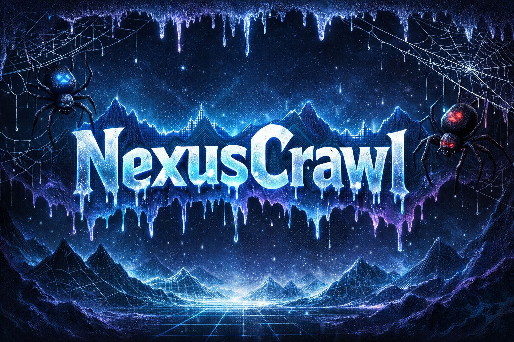

---

# NexusCrawl

An asynchronous, dual-transmission data mining, historical archival, and web reconnaissance engine. Built for civic audits, large-scale dataset extraction, deep media preservation, and source code cloning.

---

## Core Architecture

NexusCrawl utilizes a highly concurrent, hybrid event loop:

- **HTTPX (Standard Routing):** High-speed, low-overhead async requests for static DOM parsing and HTTP `HEAD` reconnaissance.
- **Playwright (Heavy Routing):** Headless Chromium integration for extracting JavaScript-rendered (React/Angular/Vue) data tables, interactive DOM elements, and executing client-side scripts before extraction.

### Resiliency & Data Pipelines

- **Exponential Backoff Shield:** A built-in `RetryMiddleware` that intercepts HTTP `429` (Rate Limit) and HTTP `403` (Forbidden) server drops, pauses the specific worker, and gracefully retries the connection without killing the primary crawl.
- **Asynchronous File Streaming:** Utilizes `aiofiles` to prevent desktop RAM bottlenecks. Data is streamed directly to disk whether it is a `.jsonl` dictionary string, a cloned `.css` file, or a massive binary.
- **Structured SQL Exporter:** Automatically routes extracted datasets into a local `nexus_database.db` SQLite database, wrapping complex row data in queryable JSON strings for immediate analysis.
- **Stream Interceptor:** Offloads HLS/Blob streams to a background `yt-dlp` threading pipeline, automatically utilizing FFmpeg to decrypt and stitch streaming video chunks into native `.mp4` files.

---

# The Spider Matrix

| CLI Name        | Target File               | Primary Function                                                                                                                  | Rendering Engine   | Output Pipeline      |
| --------------- | ------------------------- | --------------------------------------------------------------------------------------------------------------------------------- | ------------------ | -------------------- |
| `foia_hunter`   | `spiders/civic_spider.py` | Deep-crawling, recursive pagination, and async `HEAD` probes to discover and extract hidden government documents (PDF, CSV, ZIP). | HTTPX              | `AsyncMediaPipeline` |
| `table_miner`   | `spiders/table_spider.py` | Takes control of the browser to flatten complex, paginated 2D JS data grids into structured dictionaries.                         | Playwright         | `JsonLinesPipeline`  |
| `media_archive` | `spiders/video_spider.py` | Two-phase deep driller. Scans directories, queues watch pages, and streams high-res `.mp4` / `.webm` binaries.                    | HTTPX              | `AsyncMediaPipeline` |
| `web_recon`     | `spiders/recon_spider.py` | Navigates to a target, executes client-side scripts, and clones the rendered HTML, CSS, and JS into a local repository.           | Playwright + HTTPX | `SourceCodePipeline` |

---

# Installation & Setup

## 1. Install Python Dependencies

```bash
pip install -r requirements.txt
```

## 2. Install Headless Chromium (Required for Playwright)

```bash
playwright install chromium
```

## 3. Install FFmpeg (Required for Media Archival/Stream Stitching)

_Windows (via winget)_:

```bash
winget install Gyan.FFmpeg
```

---

# Execution Commands

NexusCrawl is driven entirely via the CLI using `main.py`.

## Run a spider on its default hardcoded target

```bash
python main.py --spider table_miner
```

## Override the default target with a custom URL

```bash
python main.py --spider foia_hunter --url "https://www.justice.gov/oip/foia-library"
```

## Execute a Web Reconnaissance clone

```bash
python main.py --spider web_recon --url "https://target-domain.com"
```

---

# Data Output Structure

Running the framework will automatically generate the following local directories based on the pipelines engaged:

```
/nexus_database.db
/civic_audit_data.jsonl
/media/
/recon_vault/
```

### `/civic_audit_data.jsonl`

Flat JSON Lines file for structured table data and text extraction.

### `/media/`

Stores binary files such as:

- Images
- Videos
- PDFs
- CSV datasets

### `/recon_vault/`

Cloned website source code organized by target domain and file type:

```
/recon_vault
    /domain-name
        /html
        /css
        /js
```

---

# Project Purpose

NexusCrawl is designed for large-scale information discovery and preservation workflows including:

- Civic audit investigations
- Government data discovery
- Media archival
- Web infrastructure reconnaissance
- Dataset extraction and preservation
